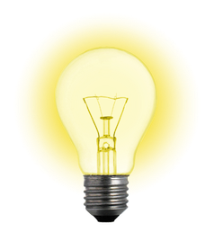
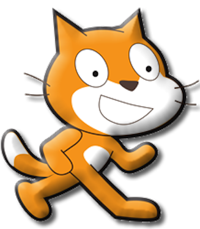

<section data-background="images/teachers_college.jpg">
</section>

#MSTU 4031
##Intro To Object Oriented Programming

Teachers College Columbia University

<strong>Basic Elements of Computer Programming</strong>

Jessica T-Skeete Education Product Manager @ General Assembly

---

##Agenda

*	Administrative Stuff
*	Introduction To Programming
	*	What is Programming
	*	MIT's Scratch

---

<section data-background="images/Columbia.jpg">
</section>

#Administrative Stuff

---

##Instructor

__Jessica T-Skeete__ jt2573@tc.columbia.edu

__Office Hours:__ Mondays 4:00 - 5:30 or by appointment.

---

##Teaching Assistant

__Kenneth Graves__ keg2132@tc.columbia.edu

__Office Hours__ Tuesdays 5:00 - 7:20

---

##You!	

---

##The Course

*	Class starts at 5:30 pm on __Mondays__

*	Recitation runs __Tuesdays__ from 7:30 to 8:30 with Kenny.

*	[Syllabus](../../README.md)

<aside class="notes">

I will take attendance in both classes. Attending on Tuesdays will not count towards you final grade, however as the labs get more difficult I will consider that you went to the lab even if the program is not complete.

</aside>

---

##The Course Objectives

*	Read code and write Java applications.

*	Understand the basics of programming (language agnostic)

*	Rapid prototype your ideas for: 

	*	Better communication 

	*	Testing and research.

---

##How To Succeed

###You MUST __code__ to learn to __code__!

<aside class="notes"> 

Each class we will have from one to eight In-Class Labs (ICLs).  Each ICL is meant to either introduce a new concept or reinforce a previous concept. ICLs provide a practical, hands-on component for exploring and examining computer science topics.
</aside>

---

<section data-background="images/Columbia_sign.jpg">
</section>

#Introduction To Programming

The computer will do what you tell it to do. 

Nothing More. Nothing Less

---

##Robot Make Me A Sandwich;

<table>
<tr>
<td><b>Type<bb></td>
<td>Groups of 3 - 4</td>
</tr>
<tr>
<td><b>Time</b></td>
<td>15 min</td>
</tr>
<tr>
<td><b>Task</b></td>
<td>Instruct a robot to make a peanut butter and jelly sandwich. </td>
</tr>
</table>

* We will share the answers at the end of class.

---

##What is a Program

"A __program__ is a set of instructions that you write to tell a computer what to do" ~ Farrell (2008)
---

##What is Programming

__Programming__ is the task of writing instructions in a language that the computer can understand.

---

##Becoming A Programmer

It's about changing how you think. 

<aside class="notes"> 
It isn't about the programming language. It is about changing how you think.
</aside>

---

##What is a programming language?

---

<section data-background="images/progLanguages.jpg">
</section>

<aside class="notes"> 
image from [www.opendocs.org](www.opendocs.org)
</aside>

---

##Pseudo Code

Pseudocode is the process of writing a program without using the syntax of a programming language.

<aside class="notes"> 
We will talk about algorithms later.

Pseudocode is a mixture of natural language and high-level programming constructs. For example,
If the door is closed and I want to exit the room, then open the door
This semester we will learn what these keywords and structures are and how they are used to create a program…

</aside>

---

##Reading Pseudo Code

Let's Read Some Code

[http://cdpn.io/wJxjI](http://cdpn.io/wJxjI)

---

##Robot! Grade My Paper

<table>
<tr>
<td><b>Type<bb></td>
<td>Groups of 3 - 4</td>
</tr>
<tr>
<td><b>Time</b></td>
<td>20 min</td>
</tr>
<tr>
<td><b>Task</b></td>
<td>Arrange the cards so that it creates a program for a computer to grade a set of assignments.</td>
</tr>
</table>

---

##MIT [Scratch](http://scratch.mit.edu/)

<aside class="notes"> 
image from Mit

Scratch is a programming language that makes it easy to create interactive stories, animations, games, music, and art. 
Scratch is designed to help young people (ages 8 and up) develop 21st century learning skills. As they create Scratch projects, young people learn important mathematical and computational ideas, while also gaining a deeper understanding of the process of design. 
</aside>

---

##Scratch Program

<table>
<tr>
<td><b>Single<bb></td>
<td>Groups of 3 - 4</td>
</tr>
<tr>
<td><b>Time</b></td>
<td>30 min</td>
</tr>
<tr>
<td><b>Task</b></td>
<td>Create a program in scratch using a minimum of 10 these blocks</td>
</tr>
</table>

Save and submit the link as an assignment.

---

##Recap

*	Programming is about giving a set of instructions to the computer. 

*	There are many programming languages but the basic principles are always the same.

*	You must think through the entire application one piece at a time.

---

## Lab Assignment

Go to the [Scratch](http://scratch.mit.edu/explore/?date=ever) website

*	Explore projects
*	Choose a project
*	Review the blocks of code. 
*	Change its behavior.

---