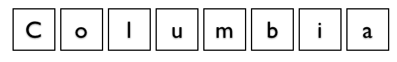
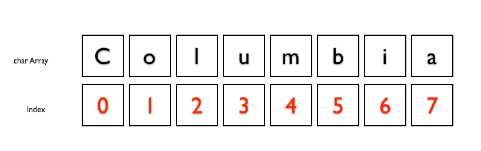
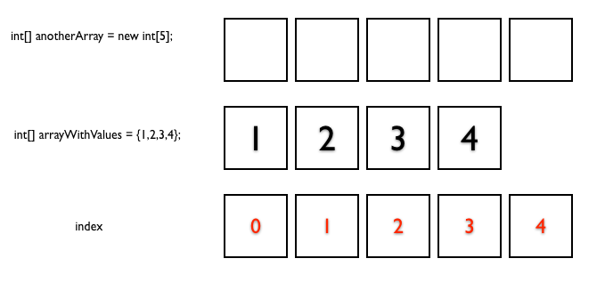

#MSTU 4031
##Intro To Object Oriented Programming


Teachers College Columbia University
Collections - (Arrays & ArrayList)
Jessica T-Skeete Education Product Manager @ General Assembly
</div>

---

##Agenda

*	Review
*	Quick Fire
*	More About Strings
*	Collections
	*	Arrays
	*	Array List
	*	Traversing Collections	
	
---

##Recap

[BottlesOfBeer.java](../Lesson_03/solution/BottlesOfBeer.java)

---

<h2><strong>QuickFire<strong></h2>

---


##QuickFire
###30min

"Write a program that prints the numbers from 1 to 100. But for multiples of three print "Fizz" instead of the number and for the multiples of five print "Buzz". For numbers which are multiples of both three and five print "FizzBuzz". 

---

##QuickFire

###FizzBuzz OutPut
1

2

Fizz

4

Buzz

Fizz

7

8

Fizz

Buzz

11

Fizz

13

14

FizzBuzz

16

17

..

cont to 100.

---


#More About Strings

<div class="label">
<p>Strings; what are they really?</p>
</div>

---

##Strings

String university = "Columbia";



<aside class="notes"> 

</aside>

---


##Strings

StringAsArray.java


---

##Array Indexes




```
	university.charAt(0);
	university.charAt(3);
```

---


#Introduction To Data Structures

---


##Data Structures

Today we're going to expand the concept of data types to include the computer science-related term 'Data Structures'


---


##Data Structures

<blockquote>a collection of data organized in some fashion. [This] structure not only stores data but also supports operations for accessing and manipulating the data</blockquote> 

(Liang, 2008, p. 706)

<aside class="notes"> 

So, its not one piece of data, for example a String name, it is a collection of String names.

</aside>

---


##Data Structures

<blockquote>a particular way of storing and organizing data in a computer so that it can be used efficiently</blockquote> 

[Wikipedia](http://en.wikipedia.org/wiki/Data_structure), retrieved on 10/10/2009)

---


##Data Structures

*	__Linear Data Structures__
	*	Array
	*	Dynamic Array (ArrayList)
*	Lists

---


##Data Structures
*	Trees
	*	Binary trees
	*	B-trees
	*	Heaps	
	*	Tries
	*	Multiway trees
	*	Space-partitioning trees
	*	Application-specific trees
*	Hashes
*	Graphs

<aside class="notes"> 

Please Note: Not all types will be covered in this course, but are presented here for illustrative purposes.

</aside>

---

#Arrays

Immutable Arrays

---

##Arrays

MyFirstArray.java

---


##MyFirstArray



---


##Arrays

*	Fixed Size
	1.	When you create an array you can initialize it with a set of values
	2.	 When you create an array you can set the number of spaces 

---

##Exercise

<table>
<tr>
<td><b>Type</b></td>
<td>Paired</td>
</tr>
<tr>
<td><b>Time</b></td>
<td>10 min</td>
</tr>
<tr>
<td><b>Task</b></td>
<td>
	<ol>
		<li>Create and array with 3 elements.</li>
		<li>Store the names of the 3 people to the right of you.</li>
		<li>Print the array to the terminal.</li>
	</ol>
</td>
</tr>
</table>

---


##Quick Answer

```java
	public class SimpleArray{
		public static void main(String[] args){
			String[] firstNames = {"Joe", "Jane", "Julie"};
			System.out.println("The first name in my list is " + firstNames[0]);
			System.out.println("The second name in my list is " + firstNames[1]);
			System.out.println("The third name in my list is " + firstNames[2]);
			System.out.println("The fourth name in my list is " + firstNames[3]);
		}
	}
```

<aside class="notes"> 


</aside>

---

##Looping Through Arrays

ArrayForLoop.java

<aside class="notes"> 


</aside>

---


##Looping Through Arrays

With the for loop we can utilize one System.out.println to successively execute a similar statement while assigning input to the array:

```java
	for (int i = 0; i < 5; i++) {
		System.out.println("What is your first name?");
		firstNames[i] = myScanner.nextLine();
	}
```

<aside class="notes"> 

What is happening here?
How many times will the program ask for a name?

</aside>

---


##Array Class

<blockquote>The Arrays class contains various static methods for sorting and searching arrays, comparing arrays, and filling array elements</blockquote> 


(Liang, 2008, p. 202)

<aside class="notes"> 

We will cover three basic methods in the Arrays class. 
</aside>

---

##Array Class

The Arrays class is in the java.util package, so we need to import it in order to use it in our program.


<aside class="notes"> 
We've seen this package before, remember java.util.Scanner? For simplicity sake lets bring in the whole package.

</aside>

---

##Google It

.sort

```
double[] numbers = {3.5, 3.9, 6.3, 5.0, 4.2, 1.8, 6.4};
java.util.Arrays.sort(numbers);
```

<aside class="notes"> 
What happens in this method?
.sort: sort a whole array or a partial array
</aside>

---


##Google It

. equals

```
	int[] list1 = {6, 8, 3, 2, 10};
	int[] list2 = {6, 8, 3, 2, 10};
	int[] list3 = {6, 8, 2, 3, 10};
	System.out.println(java.util.Arrays.equals(list1, list2));
	System.out.println(java.util.Arrays.equals(list2, list3));
```

<aside class="notes"> 

Which statement will evaluate to true?

Equals: checks whether two arrays are equal
</aside>

---


##Google It

.fill

```
int[] list1 = {6, 8, 3};
int[] list2 = {6, 8, 3, 4, 6, 8, 2, 0};
java.util.Arrays.fill(list1, 5);
java.util.Arrays.fill(list2, 1, 3, 8);
```

<aside class="notes"> 

Identify the method that fills values to the whole array?
Identify the method that fills values to part of the array?

Fill: used to fill in all or part of the array

</aside>

---

#ArrayList

Mutable Arrays

---

##ArrayList

ArrayListAnswer.java

---


##ArrayList

*	add("what you are adding")
	
*	add(index, "what you are adding")

*	size()

*	remove("what you are removing")

*	remove(index)

*	get(index)

*	indexOf("what you want to get")


<aside class="notes"> 

see <a href="http://docs.oracle.com/javase/6/docs/api/java/util/ArrayList.html">Java API</a> for more info

</aside>

---


## Assignment

Create a program that allows a school Education Technologist to keep track of the computers in the building. 

---


## Assignment

*	Welcome the user to the program.
*	Prompt the user to enter the names of the classrooms (at least 7). 
*	Prompt the user to enter the number of computers in that classroom.
*	Output the name of the classroom and the total number of computers. 
*	Output the total number of computers in the building. 

Hint: You will have to use parallel arrays. 

---

## Assignment Bonus

*	Add search functionality. Allow a user to search for a specific classroom and see the computer count. 


---


##Lab / Exercise

Your job is to create an application for English teachers.

<table>
<tr>
<td><b>Type</b></td>
<td>Paired</td>
</tr>
<tr>
<td><b>Time</b></td>
<td>Remainder Of Class</td>
</tr>
<tr>
<td><b></b></td>
<td>
	<ul>
		<li>This application should allow teachers to create a list of words that will be used in this weeks vocabulary test. </li>
		<li>There is no fixed amount of words in any vocabulary list. Let the user add until they wish to stop.</li>
		<li>The application should handle word duplication in a list.</li>
		<li>When complete, let the instructor know what their vocab list looks like, print a list of the words to the terminal. </li>
	</ul>
</td>
</tr>
</table>

---

##References

Cameron Fadjo MSTU 4031 Fall 2010 slides.


