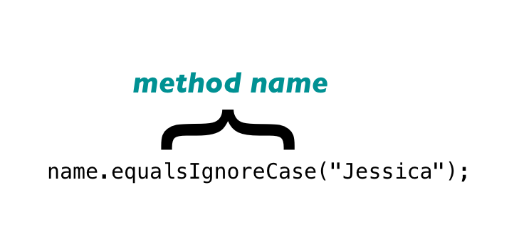
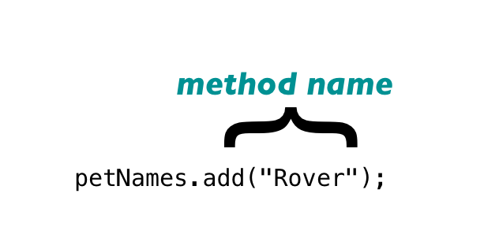
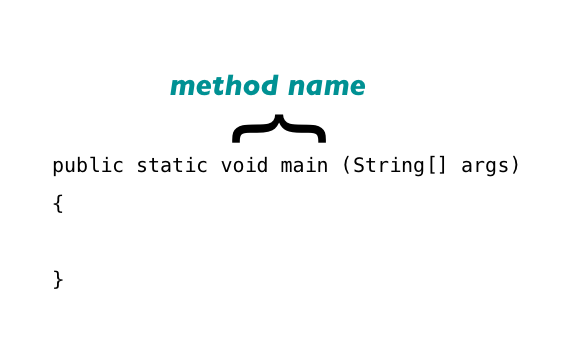
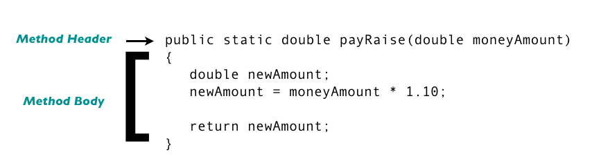
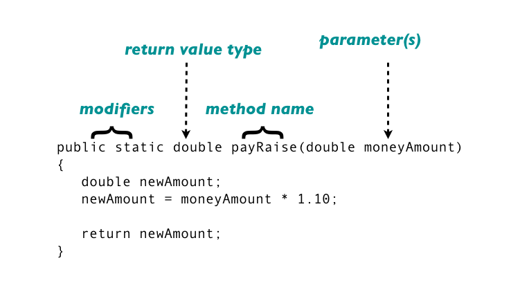
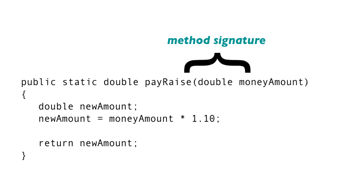

#MSTU 4031
##Intro To Object Oriented Programming


<div class="label">
<p>Teachers College Columbia University</p>
<p><strong>Methods, Test I/O, Exception Handling</strong></p>
<p>Jessica T-Skeete Education Product Manager @ General Assembly</p>
</div>

---

##Agenda

*	Recap
	*	Quick Fire
	*	Assignment 2		
*	Methods
*	Text I/O
*	Exception Handling
	
---


##Syllabus

Changes

---

##Recap


Quick Fire

---


##Recap

Assignment 2

---

#Methods

<div class="label">
<p>Methods, Functions, Subroutines</p>
</div>

---

##Methods

jCards => Grading Algorithm

<aside class="notes"> 

Two sets of cards that executed a small/ particular function in a larger program.

Assignment Grader, LetterGrade Converter
</aside>

---

##Methods

<blockquote>"A construct for grouping statements together to perform a function"</blockquote> - Liang, 2008, p. 142

---


##Methods

You need two things: 

*	Method Call
*	Method Definition

---

##Method Example

SimpleMethod.java

---

##Vocab Words Refactor

Your job is to create an application for English teachers.

<table>
<tr>
<td><b>Type</b></td>
<td>Paired</td>
</tr>
<tr>
<td><b>Time</b></td>
<td>15 min</td>
</tr>
<tr>
<td><b>Task</b></td>
<td>
	Create method that prints "Enter (1) to add a word (0) to quit." in the VocabWords.java exercise.
</td>
</tr>
</table>

---

##Method Calls

We've seen them before:

---

##Method Calls


---


##Method Calls



---

##Method Calls



---

##Method Definition

We've seen this:



---


##Method Breakdown



---


##Method Header



---


##Method Header



---


##Method Header

*	Method declarations, the header of a method, contain:
	*	Access Modifiers (public, private, protected) (optional)
	*	Method Return Type
	*	Method Name
	*	Method Parameter(s)/Argument(s) (optional)

---


##Method Declarations: Access Modifiers 

The three types of access for methods are:

*	public - (least restrictive) visible to any class in a Java 
program

*	private - (most restrictive) cannot be accessed anywhere 
outside the enclosing class

*	protected - the member can only be accessed within its own 
package

---


##Method Declarations: Return Types 

*	When a method returns nothing, then it is of type __void__

*	When a method returns something, the expected return __data type__ must be declared 

*	A method’s declared return type must match the data type of the value 
---


##Method Body


<aside class="notes">
This method includes a return statement. 

A return statement causes a value (in this example, the calculated value of newAmount) to be returned to the method call or invocation.


See SimpleMethod.java

</aside>

---

##Method

AreaCalculator.java

---

##Area Of A Triangle and Circle


<table>
<tr>
<td><b>Type</b></td>
<td>Paired</td>
</tr>
<tr>
<td><b>Time</b></td>
<td>25 min</td>
</tr>
<tr>
<td><b>Task</b></td>
<td>
	<ul>
		<li>Add a method to calculate the area of a triangle and circle.</li>
	</ul>
</td>
</tr>
</table>

---

##Instance vs Class Methods


What's up with the dot? 

---


##Instance vs Class Methods


There are two main ways to differentiate between methods in Java (or any OOP language):

---

##Instance vs Class Methods


1.	Instance Methods:
	1. Operate on an object and 
	2. Do not use the static modifier keyword

2.	Class Methods (or Static Methods):
	1.	Do not need an object instance in order to be used and
	2.	Use the static modifier keyword


<aside class="notes"> 

An Instance Method is associated with a particular instance of an object.  When we get to classes and objects we will be creating instance methods.

A Class Method, on the other hand, is associated with the class as a whole.  When we’ve created a program this semester we’ve also created a class (denoted by the ‘.class’ suffix).  Methods of this type use the static modifier and are not restricted to instances of an object.  Again, more on this next week.

</aside>

---


##Instance vs Class Methods

Instance Method

*	petNames.add(2,"Rover");  

---

##Instance vs Class Methods


Class method 

*	hello();```
*	boxSize();```

---


#Text i/o

<div class="label">
<p>Input Output</p>
</div>

---

##BirthdayWriter.java

---

##BirthdayReader.java

---


##Saving Data To A File

*	__File__: Obtain file properties, deleting and renaming files

*	__PrintWriter__ : Write data to a text file

*	__Scanner Class__: Take in user input


<aside class="notes">

We will be using a series of classes to create, modify, and update files
</aside>

---

##The File Class

*	Provides an abstraction for dealing with the machine-dependent complexities of files and path names in a machine-independent manner

*	The File class does not contain the methods for reading and writing file contents

See Java API for File [methods](http://docs.oracle.com/javase/7/docs/api/java/io/File.html)

---


##The PrintWriter Class

*	Used to write data to a text file ```java.io.PrintWriter```

*	PrintWriter output = new PrintWriter(filename);

<aside class="notes">

If the File class did not create the file to be modified, the PrintWriter class can handle this task
</aside>

---


##The Scanner Class

		Scanner input = new Scanner(new File(filename));

<aside class="notes"		
Used to read strings and primitive data from a text file

</aside>


---

#Exceptions

<div class="label">
<p>Try and Catch</p>
</div>

---

##Exceptions

Less Severe

<aside class="notes">

<blockquote>An exception is an unexpected or error condition” </blockquote> - Farrell, 2008

We’ve seen ‘errors’ throughout the semester when dealing with compilation and input
An Exception is not as severe. See the Exception Class for a list of errors. 

</aside>

---

##Types of Errors

```
public class MathError
{
	public static void main(String[] args)
	{
		int num = 13, denom = 0, result;
		result = num / denom;
	}
}
```
---

##Types of Errors


```
computer:desktop user$ java MathError
Exception in thread "main" java.lang.ArithmeticException: / by zero 
at MathError.main(MathError.java:6)
```

---


##Exceptions

Java has three basic classes of errors:

*	__Error__ - internal system errors
*	__RuntimeException__ - programming errors, such as forgetting a semi colon , out-of-bounds array, and numeric errors
*	__Exception__ - errors caused by the program and by external circumstances

---

<section data-background="../imagescolumbia_alma.jpg">
</section>

#MidTerm

<div class="label">
<p>Everything Up Until This Point</p>
</div>

---


##Midterm Project

Due: __October 23rd, 2013__

*	Design, develop, and demonstrate a proposed Java programming project to the class.

*	You are allowed to work independently or in groups of two.

*	Project files (.java and Output) & Slideshow are to be submitted to the ‘Midterm’ folder in the ‘Files’ section of Moodle by Monday, November 19th at 5 pm. (This folder will be shared with the class).

<aside class="notes"> 


</aside>

---

##Midterm Presentations

Present your project with five slides:

1.	Cover slide with project name, team members, and date
2.	Project overview: What does the program do?
3.	Description of each custom class
4.	Screen shot of program in operation
5.	Final slide - Your choice


Presentations with more than five slides will be marked down

---

##Technical Requirements

Create a program of your choice that: 

*	Utilizes arrays (arrayslist)
*	Loops
*	Conditionals
*	Text i/o
*	Exception Handling
*	Methods

3 points awarded for level of complexity.


---


##Assignment

<table>
<tr>
<td><b>Type</b></td>
<td>Paired</td>
</tr>
<tr>
<td><b>Time</b></td>
<td>Remainder Of Class</td>
</tr>
<tr>
<td><b>Task</b></td>
<td>
	Find areas where you can utilize methods in VocabList and assignment 3
</td>
</tr>
</table>

*	Ask yourself, what needs to be returned?

*	What should be passed as arguments?

---

##References

Cameron Fadjo MSTU 4031 Fall 2010 slides.


