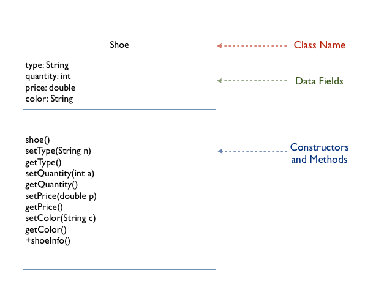
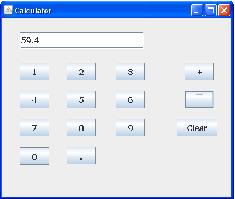
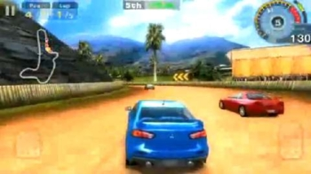

<section data-background="images/teachers_college.jpg">
</section>

#MSTU 4031
##Intro To Object Oriented Programming

Teachers College Columbia University
Brainstorming and Intro To Object Oriented Programming
Jessica T-Skeete Education Product Manager @ General Assembly

---

##Agenda

*	Recap
*	OOP Inheritance
*	Intro To GUIs
	
---

<section data-background="../arial_columbia.jpg">
</section>

#Recap

Vocabulary Test

---

##Recap Quiz

####What Am I?

*	Used as a blueprint to create objects 

*	I can be used to create objects

<aside class="notes">

</aside>

---

##Recap Quiz

####Name 2 Java classes

<aside class="notes">

</aside>

---

##Recap Quiz

####How can I access private variables?

<aside class="notes">

</aside>

---

##Recap Quiz

####True Or False

*	Public variables are the least restrictive and are visible to any class in a Java program. 

<aside class="notes">

</aside>

---

##Recap Quiz

####True Or False

*	Protected variables are the most restrictive and cannot be accessed anywhere outside the enclosing class.

<aside class="notes">

</aside>

---

<section data-background="../images/columbia_alma.jpg">
</section>

#UML

Unified Modeling Language

<aside class="notes"> 

UML is a standardized illustration of class templates.

</aside>

---

##UML

<aside class="notes">
	Draw a UML for the shapes class. 
	Groups come to the board.
</aside>

---

<section data-background="images/Columbia.jpg">
</section>
#INHERITANCE

I Got It From My Mama

---

##Inheritance

A circle is a Shape
<aside class="notes"> 

</aside>

---

##Inheritance

MyShapes.java

---

<section data-background="images/Columbia_sign.jpg">
</section>
#GUIs

Graphical User Interface aka Making things look pretty.

---

##GUI

Visually represent the information and actions available to a user.

---

##Graphical User Interface

---

##Graphical User Interface

---

##Graphical User Interface

HelloGui.java

<aside class="notes"> 
	Change the application so it says "Hello Jessica"
</aside>

---

##JOpitionPane Docs

This is an exercise in using Documentation. Java API.

import javax.swing.JOptionPane 

<table>
<tr>
<td><b>Type</b></td>
<td>Individuals</td>
</tr>
<tr>
<td><b>Time</b></td>
<td>5 min</td>
</tr>
<tr>
<td><b>Task</b></td>
<td>
	Find the JOptionPane in the Java API. Answer the following: 
	<ul>
		<li>What does it inherit from?</li>
		<li>Be prepared to explain what 2 methods do.</li>
	</ul>
</td>
</tr>
</table>

---

##HelloManyWindows.java

This is an exercise in using Documentation. Java API.

<table>
<tr>
<td><b>Type</b></td>
<td>Paired</td>
</tr>
<tr>
<td><b>Time</b></td>
<td>15 min</td>
</tr>
<tr>
<td><b>Task</b></td>
<td>
	Open HelloManyWindow.java and complete the file. I will demo the application for you. 
</td>
</tr>
</table>

---

##Graphical User Interface

*	One of the frameworks used to create the Java GUIs is the Foundation Classes.

---

##Graphical User Interface

*	The Java Foundation Classes (JFC) consist of:

	*	Abstract Window Toolkit (AWT)
	*	Java 2D
	*	Swing

<aside class="notes"> 

</aside>

---

##Abstract Window Toolkit

*	Using AWT your GUI elements will look like it is native to your OS.

*	AWT was superseded by the Swing toolkit in J2SE 1.2 (we’ll still use it)

---

##Swing

Swing was developed to provide a more sophisticated set of GUI components than the earlier Abstract Window Toolkit.

*	Java apps running on Windows and using the Swing toolkit will look like a native Windows app


*	Java apps using the Swing toolkit and running on Mac OS X will look like native Mac OS X apps

<aside class="notes"> 

Find someone with a Mac / windows see what it looks like. 

</aside>

---

##Java 2D

*	API for drawing two-dimensional graphics 

*	Draw using a paint method and compositing the result onto the screen”

*	Part of the current JSE 6 release, consists of six packages and is apart of Swing.

<aside class="notes"> 

</aside>

---

##SWING vs AWT

*	Swing components are referred to as lightweight components because they do not rely on platform native GUI resources

*	AWT, or the Abstract Windows Toolkit, components are referred to as heavyweight components because they are heavily dependent upon native GUI resources

<aside class="notes"> 

While still supported, AWT has mostly been deprecated for Swing components

</aside>

---

##StudentRegistration.java

Lets update the first Java App we ever create.

<table>
<tr>
<td><b>Type</b></td>
<td>Paired</td>
</tr>
<tr>
<td><b>Time</b></td>
<td>Remainder Of Class</td>
</tr>
<tr>
<td><b>Task</b></td>
<td>
	Create student registration application. This application should ask students for their:
	<ul>
		<li>First and Last Name</li>
		<li>Program</li>
		<li>Degree</li>
		<li>Credits taken first semester</li>
		<li>Credits taken second semester</li>
	</ul>

After collecting the information, the program should output all variables to the console including total credits. 

Make sure to create a student class.
</td>
</tr>
</table>

<aside class="notes">
Draw UML and pseudo code together. 
</aside>

---

##References

Cameron Fadjo MSTU 4031 Fall 2010 slides.

---

