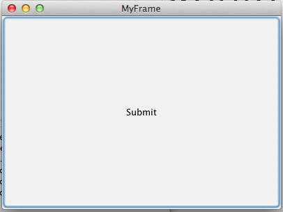
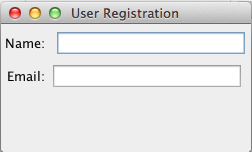
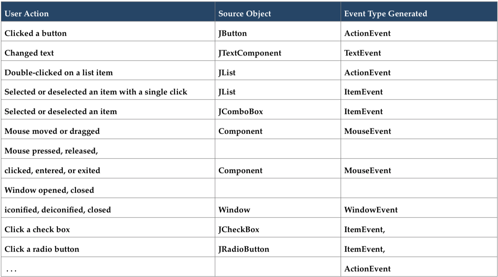

<section data-background="images/teachers_college.jpg">
</section>

#MSTU 4031
##Object Oriented Programming

<div>
Teachers College Columbia University
More GUIs & Events
Jessica T-Skeete Education Product Manager @ General Assembly
</div>


##Agenda

*	Review
*	Containers, Componets and Helper Classes
*	Layouts
*	Events & Action Listeners
	

<section data-background="../arial_columbia.jpg">
</section>

#Review

<div class="label">
<p>Review</p>
</div>


##HelloManyWindows.java


<section data-background="../images/columbia_alma.jpg">
</section>

#More GUIs

<div class="label">
<p>Container, Component & Helper Classes</p>
</div>


##container.java

Open Container.java

*	Change the name of your Frame. 
*	Change the size of your frame.
*	What does each line do?


##Java GUI API

Loosely referred to as the GUI API, Java has three types of classes used for GUIs


##Java GUI API


__Container__ classes: Used to contain other components. 


<aside class="notes">
Draw Container and component onwhite board.
</aside>

---

##Java GUI API

These classes are used to contain other components

*	JFrame
*	JPanel
*	JApplet

<aside class="notes">
Draw Container on white board.
</aside>


##Java GUI API

__Component__ classes: Classified as the elements (components) within the containers


<aside class="notes">
Draw Component on white board.
</aside>


##Java GUI API

These classes are components to be used within a container

*	JButton
*	JTextField
*	JTextArea
*	JComboBox
*	JList
*	JRadioButton
*	JMenu


##Java GUI API

__Helper__ classes: Elements such as graphics, color, font, and dimension used to support GUI components


<aside class="notes">

</aside>


##Java GUI API

These classes are used to support GUI components

*	Graphics
*	Color
*	Font
*	FontMetrics
*	Dimension

<aside class="notes">

</aside>


##Creating Forms


<aside class="notes">
What we will create.
</aside>


##Creating Forms

*	Create a file called Component.java
*	Create a JFrame object
*	Use the following methods on your JFrame object:
	*	setSize -> 500 by 400 pixels
    *	setLocationRelativeTo -> set this value to 'null'
   	*	setDefaultCloseOperation -> set this to JFrame.EXIT_ON_CLOSE
    *	setVisible -> set this value to ‘true’

*	Add a JButton to your frame. 

Hint: The class for buttons is JButton. 
The method to add buttons to the frame is in the JFrame Class.

<aside class="notes">
Component.java
</aside>


<section data-background="images/Columbia.jpg">
</section>
#Layouts

<div class="label">
<p>Why is there a giant button in the middle of my screen?</p>
</div>


##Layouts

In Java nothing is given, you have to tell the program EVERYTHING!

<aside class="notes"> 
Draw layout on board. 
</aside>


##Layouts

There are three basic layout managers available:

*	FlowLayout
*	GridLayout
*	BorderLayout

A layout manager is a level of abstraction within Java to map user interface elements on all window systems

<aside class="notes"> 
Draw login with the components
</aside>


##FlowLayout

*	The simplest of the three layout managers

*	Components are arranged a container (such as JPanel or JFrame) from left to right in the order in which they were created.

*	FlowLayout has three parameter options for designating alignment within the container (RIGHT, LEFT, or CENTER)

<aside class="notes"> 

</aside>


##NameEmail.java



<aside class="notes"> 

</aside>


##FlowLayout

1.	Create a file called NameEmail.java

2.	Import the Swing package (```import javax.swing.*;```) and the FlowLayout class from the AWT package (import java.awt.FlowLayout;)

3.	Create the main method, create two JLabels and two JTextFields to hold 'Name' info and ‘Email’ info, respectively.
	
4.	Create a frame for the GUI using JFrame

5.	Create and set the layout using the FlowLayout manager

6.	Set the layout type to the frame using the 'setLayout()' method

7.	Add the labels using the getContentPane() method

8.	Use the following methods setSize -> set this to (200, 100), setLocationRelativeTo, setDefaultCloseOperation, setVisible


##Name Email

<table>
<tr>
<td><b>Type</b></td>
<td>Paired</td>
</tr>
<tr>
<td><b>Time</b></td>
<td>10 min</td>
</tr>
<tr>
<td><b>Task</b></td>
<td>
	<ul>
		<li>Add a button to the window by creating a JButton object
		JButton button = new JButton("Submit");</li>
		<li>Remember to modify the size of the window so that the button 		fits</li>
		<li>HINT: The height is the second parameter in setSize()</li>
</td>
</tr>
</table>


##GridLayout

<aside class="notes">

*	The second of three layout managers within the AWT class, GridLayout uses matrix formation to order the layout.

*	Using numerical values for rows and columns, GridLayout creates these rows and fills in values from left to right

*	If the rows and columns are set to a specific value and one needs to be over-ridden, the column value is adjusted to accommodate for the components

<aside class="notes"> 

*	All components are given equal size within the container (unlike FlowLayout where component parameters determine the size of each component)

*	In GridLayout, just as in FlowLayout, the order in which the elements are added determines the location of the container

</aside>


##NameEmailInGrid.java

<aside class="notes"> 

</aside>


##BorderLayout

The most complex of the three layout managers, BorderLayout divides the window into five discreet areas:

*	East, West
*	South, North
*	Center


<aside class="notes"> 
Components within the BorderLayout manager are laid out according to their preferred size and where they are placed in the container.
</aside>


##ImageAndBoarders.java

<aside class="notes"> 

</aside>


##ThePack

<blockquote>"The pack method sizes the frame so that all its contents are at or above their preferred sizes. An alternative to pack is to establish a frame size explicitly by calling setSize or setBounds (which also sets the frame location). In general, using pack is preferable to calling setSize, since pack leaves the frame layout manager in charge of the frame size, and layout managers are good at adjusting to platform dependencies and other factors that affect component size."
</blockquote>

<aside class="notes"> 
[The Pack Method](- http://docs.oracle.com/javase/tutorial/uiswing/components/frame.html
)
</aside>


<section data-background="images/Columbia_sign.jpg">
</section>

#EVENTS

<div class="label">
<p>ActionListeners & Events</p>

</div>


##Events

####What is an event?

<aside class="notes"> 

</aside>


##Events

Events are triggered by:

*	external user actions
*	internal program activities

<aside class="notes"> 
An event can be defined as a signal to the program that something has happened.
</aside>


##Events

*	_Procedural programming_ is executed in procedural order.

*	In _event-driven programming_, code is executed upon activation of events.

*	The modern approach to handling events is based on the _delegation-based model_, which defines standard and consistent mechanisms to generate and process events.


##Events

<aside class="notes"> 

*	A source generates an event and sends it to one or more listeners. 

*	The listener waits until it receives an event. Once received, the listener processes the event and then returns back to the source. 

*	The listener must register with a source in order to receive an event notification. This provides an important benefit: notifications are sent only to listeners that want to receive them.

*	The advantage of this design is that the application logic that processes events is separated from the user  interface logic that generates those events. 

*	A user interface element is able to "delegate"  the processing of an event to a separate piece of code.

*	In the delegation model, an event is an object that describes a state change in a source. An event can be defined as a type of signal to the program that something has happened.

*	The event is an object generated by external user actions such as mouse movements, mouse button clicks, and keystrokes, or by the operating system, such as a timer.

*	The GUI component on which an event is generated is called the source event.
</aside>


##Events



<aside class="notes"> 

</aside>


##EventsAndButtons.java


##Events

A listener has two major requirements:

1.	It must have been registered with one or more sources  to receive  notifications about specific types of events. 

2.	It must implement methods to receive and process these notifications.

<aside class="notes"> 

</aside>


##Events

```
ActionListener listener = new ActionListener() {
	public void actionPerformed(ActionEvent e) {
		//Do Something
	}	
};
```


##Events

```
button.addActionListener(listener);
```

<aside class="notes"> 

</aside>


##References

Cameron Fadjo MSTU 4031 Fall 2010 slides.

*	http://www.andrew.cmu.edu/course/90-754/umlucdfaq.html
*	http://stackoverflow.com/questions/408820/what-is-the-difference-between-swing-and-awt
*	http://www.falkhausen.de/en/diagram/html/javax.swing.JComponents.html
*	http://docs.oracle.com/javase/tutorial/uiswing/layout/visual.html#border
*	http://www.javamex.com/tutorials/swing/layouts.shtml
*	http://docs.oracle.com/javase/tutorial/uiswing/components/frame.html

---

