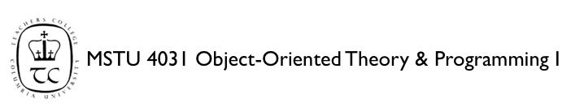

##Assignment - 8 (Fall 2013)

Due: Monday December 2nd, 2013 @ 5:30pm


###Assignment:

*	Program your final project as described in your UML that we discussed.

*	Create UML for your GUI classes (not necessary to code). Use your wireframe to help you achieve this.


###Deliverables: 

All files must be zipped in an ‘Archive’ (.zip) file and uploaded to Moodle. Make sure your file is named:

* LastName_FirstName_UNI_Labx.zip

__Note__ 

Please add comments to your code: 

```java
/*File Name, Your name, uni, email, date, Lab number, comments*/
```


###GRADING

This lab should be uploaded to Moodle. It will not be graded.


