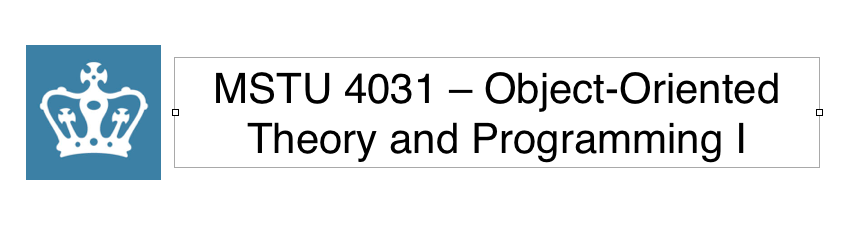

###TEACHERS COLLEGE, COLUMBIA UNIVERSITY (Fall 2013)

	Lecture: Mondays, 9/9 - 12/23, from 5:30 – 8:30pm in MY345B

	Recitation: Tuesday, 09/10 – 12/17 from 7:00 – 8:00


*	__Jessica T-Skeete__ - jt2573@tc.columbia.edu
	*	Office Hours: Mondays from 4:30 to 6:00 pm 2nd Floor Library or By Appointment


*	__Kenneth Grave__ - Email: kg2123@tc.columbia.edu
	*	Office Hours Tuesday from 5:00pm – 7:20pm or By Appointment


##Syllabus
| Date | Lesson |
|------|--------|	
|September 09th, 2013|	__1__ - Introduction to Programming: Basic Elements of Computer Programming.|
|September 16th, 2013|	__2__ - Introduction to Programming: Basic Elements of Computer Programming Cont. Variables, Data Types, Operators, Sequence, and Input|
|September 23th, 2013|	__3__ - Introduction to Programming: Operators, Conditionals and Loops.|
|September 30th, 2013|	__4__ - Introduction to Programming: Data Structures and Arrays.|
|October 7th, 2013|	__5__- Introduction to Programming: Methods, Parameters, Objects, Classes, and Set/Get Methods|
|October 14th, 2013| __6__- Midterm Examination|
|October 23nd, 2013	| __7__- Java Concepts: OOP Basics, Exception Handling, Strings, and Text I/O|
|October 28th, 2013	| __8__ - Java Concepts: OOP Review & Approaching a Problem|
|November 4th, 2013	| __9__ - Java Concepts: GUI Basics|
|November 11th, 2013| __10__ -  OOP Concepts: Introduction to Object-Oriented Theory & Events |
|November 18th, 2013| __11__ - Midterm Project / Final Project check in; OOP Concepts: Introduction to Inheritance, Polymorphism, Abstract Classes, and Interfaces, Reverse engineering games and drawing |
|November 25th, 2013| __12__ - Review |
|December 2rd, 2012| __13__ - Lab Session: Intro To Objective –C / or Android Development|
|December 9th, 2012	| __14__ - Lab Session: Intro To Objective –C / or Android Development|
|December 16th, 2012| __15__ - Final Presentations and Software Testing|

*Subject to change depending on the pace of the course.

##Course Information

[Web site](http://www.jessicaGA.github.io/MSTU_4031)

###Recitation
Students are required to attend and participate in all weekly recitation sessions. The Object-Oriented Theory and Programming I Recitation is concentrated time for reinforcing programming concepts through practice. The lab is facilitated by Kenneth Graves.

###Textbooks:
Cay, S. Horstmann (2011) Java For Everyone: Late Objects. 2nd. Edition.

####Recommended Textbook: 

Sierra, K & Bates, B. (2005) Head First Java. Second Edition. Cambridge, MA: O'Reilly Text Editors 

###Required Software (If using own computers)
*	Mac OSX
	*	SublimeText 2(Mac OS X) - http://www.sublimetext.com/
	*	Eclipse Standard 4.3 - http://www.eclipse.org/

	
*	Windows
	*	SublimeText 2 (Windows) - http://www.sublimetext.com/
	*	Gow - https://github.com/bmatzelle/gow

##Grading

| Assignments | % oF Final Grade|
|-----|-----|
|Projects| 50% |		
|Lab Assignments| 40% |                                    
|Class Participation| 10% |


###Grading and Evaluation Details 

####Grading of Labs

Throughout the semester you will be assigned an out-of-class lab assignment that is due the following week before class. Submission of lab assignment material includes the following:

*	Source Files (.java)
*	Output [Console-based apps] or Screenshots [GUI apps] in a Microsoft Word (.doc) or PDF (.pdf) file

All files must be zipped in an ‘Archive’ (.zip) file, named with the proper naming convention ```LastName_FirstName_UNI_Labx.zip``` and uploaded to Moodle before the start of the following class session.

**Note:** Labx refers to number of the lab. 


	Each lab will be graded on a 3-point scale.
	Exceptional work that meets all lab requirements and contains no significant errors 	merits a grade of 3.

	Work that meets the majority of the requirements with some minor coding issues merits 	a grade of 2.

	Late submissions (those that are submitted up to one week late), submissions that do 	not compile, and submissions that do not meet the requirements of the lab assignments 	merit a grade of 1.

	Labs submitted more than one week after the due date merits a grade of 0.


####In-Class Labs
During each class there are a number of In-Class Labs (ICLs) incorporated into the lecture to support and reinforce session topics. ICLs are not evaluated, but are required for a participation grade.

Periodic Assessments
Throughout the semester periodic assessments are distributed as part of the overall evaluation of your progress. Unlike the examination that counts towards your final grade, these assessments are graded but are not factored into your final grade.

Examinations
There will be two take home examinations (Midterm and Final)

Projects
Task based learning assignments.


####Incompletes:
The grade of Incomplete will be assigned only when the course attendance requirement has been met but, for reasons satisfactory to the instructor, the granting of a final grade has been postponed because certain course assignments are outstanding. If the outstanding assignments are completed within one calendar year from the date of the close of term in which the grade of Incomplete was received and a final grade submitted, the final grade will be recorded on the permanent transcript, replacing the grade of Incomplete, with a transcript notation indicating the date that the grade of Incomplete was replaced by a final grade. If the outstanding work is not completed within one calendar year from the date of the close of term in which the grade of Incomplete was received, the grade will remain as a permanent Incomplete on the transcript. In such instances, if the course is a required course or part of an approved program of study, students will be required to re-enroll in the course including repayment of all tuition and fee charges for the new registration and satisfactorily complete all course requirements. If the required course is not offered in subsequent terms, the student should speak with the faculty advisor or Program Coordinator about their options for fulfilling the degree requirement. Doctoral students with six or more credits with grades of Incomplete included on their program of study will not be allowed to sit for the certification exam.


####Information for Students with Disabilities:
The College will make reasonable accommodations for persons with documented disabilities. Students are encouraged to contact the Office of Access and Services for Individuals with Disabilities for information about registration (166 Thorndike Hall). Services are available only to students who are registered and submit appropriate documentation. As your instructor, I am happy to discuss specific needs with you as
well. 

####Plagiarism:
In the field of computer science it is very easy to “borrow” code from other sources. However, if you do borrow code then you must document it. Plagiarism will not be tolerated. If any student is caught handing in an assignment or final project that is plagiarized, he or she will be subject to consequences specified in the guidelines provided by Teachers College, Columbia University.

Document code that you have taken from online forms, tutorials etc…

