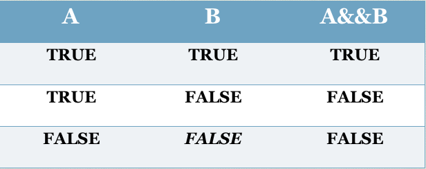
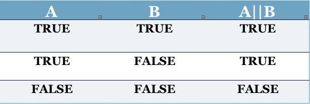

#MSTU 4031
##Intro To Object Oriented Programming


<div class="label">
<p>Teachers College Columbia University</p>
<p><strong>Making Decisions</strong></p>
<p>(<strong>Conditionals & Loops</strong>)</p>
<p>Jessica T-Skeete Education Product Manager @ General Assembly</p>
</div>

---


##Agenda

*	Review Tip Calculator
*	Conditional Logic
	*	Conditional Statements
	*	Comparison Operators
	*	Switch Statements	
*	Strings	
*	Loops


##Recap

###TipCalculator.java

---


<section data-background="images/Columbia.jpg">
</section>

#Conditional Logic

<div class="label">
<p>Making Decisions</p>
</div>

---

##Conditionals

*	Simple Statements: One step follows another unconditionally.

*	__Decision Structures__ Choosing between alternative courses of action based on some value within a program. 

<aside class="notes"> 
All decision structures have two possible outcomes: true or false.
</aside>

---

##Flow Chart

Draw Flow Chart: Crossing the street. 
Registering for a course.

<aside class="notes"> 

</aside>

---


<section data-background="images/columbia_alma.jpg">
</section>

#Decisions in Java

<div class="label">
<p>If, else, switch</p>
</div>

---


##Decisions in Java

To make a decision in Java you need __comparison operators__.

*	A comparison operator is used to compare two values (such as ints or doubles)

*	Comparison operators can be used to compare values assigned to variables

*	Results from comparison operators can be assigned to boolean variables (variables that contain either true of false)

---

##Comparison Operators


<aside class="notes"> 
</aside>

---


##Conditional Statements

```java
	if (condition){
		//code to execute if true.
	}
```

<aside class="notes"> 

The code between the curly braces will only execute if <strong>condition</strong> evaluates to true.
</aside>

---


##Conditional Statements

###IFExample.java

---


##Conditional Statements

“A simple if statement executes an action if and only if the condition is true” (Liang, 2008, p. 73). 

<aside class="notes"> 


</aside>

---

##Conditional Statements

###CanIRentACar.java

---


##Conditional Statements

<blockquote>"An if...else statement executes statements for the true case if the boolean expression evaluates to true; otherwise, statements for the [else] are executed"</blockquote> - (Liang, 2008, p. 75)

<aside class="notes"> 

Point back to the decision tree, and show students how if, else will function.

</aside>

---

##Multiple Conditions

An if...else if statements can be linked together for multiple conditions to be evaluated.

---

##Exercise
In this ICL we are going to explore the concept of conditionals using the if...else statement and user input.

<table>
<tr>
<td><b>Type</b></td>
<td>Grouped</td>
</tr>
<tr>
<td><b>Time</b></td>
<td>20 min</td>
</tr>
<tr>
<td><b>Task</b></td>
<td>
	<ol>
		<li>Create a file named ‘SecretNumber.java’</li>
		<li>Ask the user to guess a number between 1 and 10.</li>
		<li>Compare the guessed number to a pre-defined numerical value and print 		out a simple statement to let the user know if they won or lost.</li>
	</ol>
</td>
</tr>
</table>

---


##Decision Operators

*	__AND__
*	__OR__
*	__NOT__

###LogicalOperators.java

<aside class="notes"> 
Draw a flow chart on the wall. Grant algorithm for MSTU Doctoral students. Need to be doctoral students and a MSTU for 5,000, 000 grant.

Ask students to open file look at it and then run the file. Have them change the operator and run the file again.
</aside>

---

##Decision Operators


<aside class="notes"> 


</aside>

---

##Decision Operators


<aside class="notes"> 


</aside>

---

##Switching It Up

With switch statements, we can handle multiple conditions with greater efficiency.

<blockquote>"The switch statement checks all cases and executes the statements in the matched case"</blockquote> - (Liang, 2008, p. 87).

<aside class="notes"> 

With CanIRentACar.java we had a program example where there were multiple conditions to be evaluated and, in the example with multiple conditions with similar outputs, we repeated outputs with the same condition.
</aside>

---


##Switch Statements


```java
	switch (expression) {
		case value1: statement(s)1;
			break;
		case value2: statement(s)2;
			break;
	}
```

---

##Switch Statements

###SwitchComparison.java

---


<section data-background="images/take_break.jpeg">
</section>

#10 min

---


<section data-background="images/Columbia_sign.jpg">
</section>

#Strings

<div class="label">
<p>Comparing Strings</p>
</div>

---

##String Comparison

###1 == 2

###"Java" != "Java" 


<aside class="notes"> 

To compare strings (or reference types) we can't use the same operators we used when working with primitive data types. 

</aside>

---

##String Comparison


equalsIgnoreCase

<aside class="notes"> 

Take the class through looking up methods in the Java API docs.
</aside>

---

##String Comparison

```
		String favoriteColor = “blue”;
		if (favoriteColor.equalsIgnoreCase("blue")) {
			System.out.println(""Blue really is a great color");
		} else if (favoriteColor.equalsIgnoreCase("green")) {
			System.out.println("Green! That’s a good one, too.");
		} else {
			System.out.println("Is that made by Crayola?");
		}
```
<aside class="notes"> 


</aside>

---

##Exercise

<table>
<tr>
<td><b>Type</b></td>
<td>Group</td>
</tr>
<tr>
<td><b>Time</b></td>
<td>15 min</td>
</tr>
<tr>
<td><b>Task</b></td>
<td>Ask the user to enter the name of the president of Teachers College. Provide feedback if they guess correctly or incorrectly. </td>
</tr>
</table>


<section data-background="images/arial_columbia.jpg">
</section>

#LOOPS

<div class="label">
<p>Repetition Repetition Repetition</p>
</div>

---


##Loops

*	A loop is a structure that allows repeated execution of a block of statements.

*	Boolean statements determine if the loop will execute.

<aside class="notes"> 

Draw flow chart for grading papers. Make sure to point out where we saw loops in the jCards.

</aside>

---

##While Loops

This loop statement will continue to execute as long as the condition evaluates to true

```
	while (Condition) {
		Statement(s);
	}
```

<aside class="notes"> 

The while loop is a pre-test loop. The test happens before the loop is executed.
</aside>

---

##Do While Loops

The do...while loop is used when there are statements that must be executed at least once before a condition is evaluated.

```
	do {
		Statement(s);
	} while (Condition);
```

<aside class="notes"> 
The do…while loop is a post-test. The test happens after the loop has executed.
</aside>

---

##For Loops

The for loop statement is used “when a definite number of loop iterations is required” (Joyce, 2008)


```
	for (Initialization; Condition; Update) {
		Statement(s);
	}
```

<aside class="notes"> 

Use the for loop when you know how many times you would like a program to execute. 

</aside>

---

##For Loops

__Initialization__ - set at the outset, this is executed once when the program first reaches the for loop

__Condition__ - tested each time the for loop completes (at the start of each iteration)

__Update__ - evaluated several times (at the end of each iteration)


```
	for (int i = 0; int i < 10; i++) {
		System.out.prinln("This is " + i + " time the loop ran");
	}
```

<aside class="notes"> 

Draw a diagram along to demonstrate what is happening. 
How many times will the loop run. 

</aside>

---

##Working With Loops

###DoWhile.java
###While.java
###ForLoop.java

---

##Short Hand Arithmetic


---


## Lab Assignment

Create a Quiz with 4 multiple-choice questions and 2 typed questions. This application should:

*	Welcome the user to the program.
*	Prompt the user with a question and 3 choices. 
*	Determine if the answer is correct
*	Keep a running count of the correct answers.
*	Display the score at the end of the quiz, and the words pass or failed (depends on if they receive over 50%). 

---


<section data-background="images/2pears.png">
</section>

#Paired Programming

---

## Paired Programming

*	Used by many computer engineering teams
*	One computer two brains
*	One driver, one navigator / observer


<aside class="notes"> 

The act of pair programming involves working with your pair to think through a problem and implement a solution on one computer.

When done with the problem, make sure to email your pair the solution. 

</aside>


---

##Exercise

<table>
<tr>
<td><b>Type</b></td>
<td>Paired</td>
</tr>
<tr>
<td><b>Time</b></td>
<td>Remaning Of Class</td>
</tr>
<tr>
<td><b>Task</b></td>
<td>Write a Java program that utilizes a loop to print the lyrics to <a href="http://www.99-bottles-of-beer.net/lyrics.html"">99 Bottles Of Beer</a>
</td>
</tr>
</table>


##References

Cameron Fadjo MSTU 4031 Fall 2010 slides.


