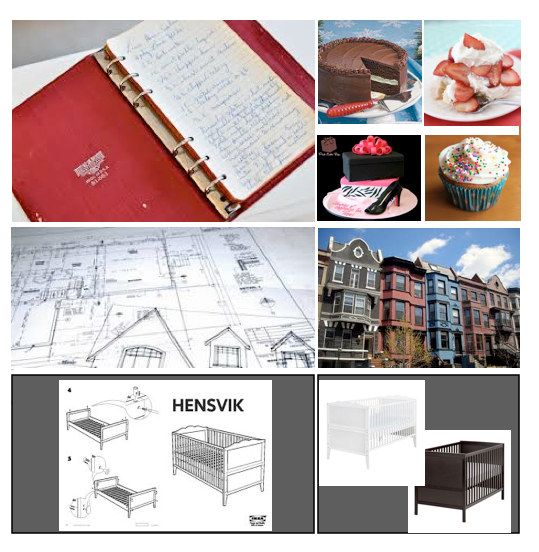

<section data-background="images/teachers_college.jpg">
</section>
#MSTU 4031
##Intro To Object Oriented Programming


<div class="label">
<p>Teachers College Columbia University</p>
<p><strong>Brainstorming & OOP</strong></p>
<p>Jessica T-Skeete Education Product Manager @ General Assembly</p>
</div>
---

##Agenda

*	Starting a Project
	*	Brainstorming
	*	Storyboarding
	*	MVP (aka Midterm)
*	Debugging
*	Object Oriented Programming
	
---

<section data-background="images/Brainstorming.jpg">
</section>

#Brainstorming

<div class="label">
<p>How To Start?</p>
</div>

---

##Brainstorming
###20min

---

##Storyboarding
###40min

*	10 min on your own
*	10 min share
*	10 min share again
*	10 min share w/ class (standup)

---


<section data-background="images/arial_columbia.jpg">
</section>

#Debugging

<div class="label">
<p>Its NOT Working!!!!</p>
</div>

---


##Debugging

Always start be defining the problem. 

*	The wrong variable value is printing

*	“None of my code works”

---


##Debugging: Level __1__

1.	Check for compile errors (after javac)
2.	What line does it tell you to go to?
3.	Got to the line number
	*	Check a couple of lines above.	

The location may not be correct but is a good place to start


---

##Debugging: Level __2__
	
So no compile errors but not getting the right answer?

*	Try printing the variable ```System.out.println() 
*	Slightly change the logic.

---


##Debugging: Level __3__

*	Break code into sections? Test / run a section at a time.

---

##Debugging: Level __4__

Get help!

1.	Google the Problem
2.	Read Stack overflow (from the second thread post)
3.	Java API documentation


---


<section data-background="images/columbia_alma.jpg">
</section>

#Object Oriented Programming

<div class="label">
<p>You down with OOP?</p>
</div>

<aside class="notes"> 

So far this semester we have learned the basics of programming.  Now, we’re going to apply what we’ve learned to the programming paradigm of ‘objects’.

We’ve covered:
Data Structures
Data fields (also called ‘variables’)
Methods

</aside>

---


##OOP Elements

Later in this semester we will cover the following OOP elements:

*	Data Abstraction
*	Encapsulation
*	Polymorphism
*	Inheritance

---


##Objects And Classes



<aside class="notes"> 

Analogies to help with understanding

*	Blueprint for a house and an actual house.
*	Cake Recipe and an actual cake.
*	Ikea manual for a desk and actual assembled desk.

</aside>

---


##Objects And Classes

*	Classes are used to create objects

```Class objectName = new Class();```

<aside class="notes"> 
	We've seen this before
</aside>

---


##Objects And Classes

```Scanner myScanner = new Scanner();```

---


##Objects And Classes

Let's make our own classes

<aside class="notes"> 
Shapes.java
Draw UML with a description of what we are doing.

</aside>

---

##Objects And Classes

*	A class is a used as a blueprint to create objects of that class

*	A class is a design plan; it describes the way in which you intend to combine and use pieces of data

*	“The class (blueprint) describes the state (data field or variable) and behavior (method) that the objects of the class all share.”

---


##Objects And Classes

This completes the intro, more next week. 

---

##References

Cameron Fadjo MSTU 4031 Fall 2010 slides.

---

